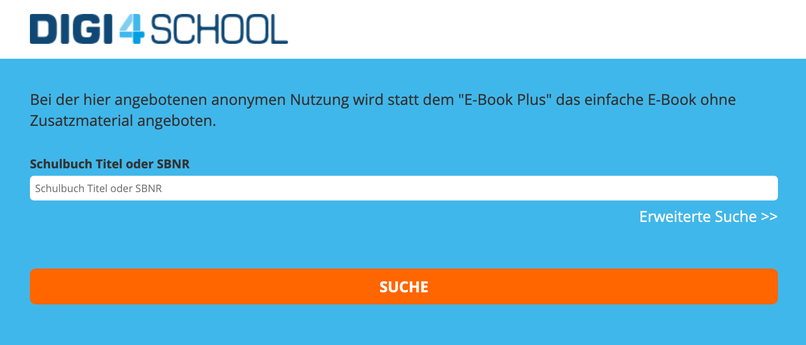

# DigiScrapper

## Disclaimer
All of the books I scrapped are avilable for **free** at the current time (25.03.2020), so everything I downloaded for myself (**not** for sharing purposes) is completely legal. If you come across this at a later point in time, the offer of free books might no longer be active or the whole site's architecture changed and thus my code won't work anymore.

## Short and simple - What is it?
It's a multithreaded scrapper-tool which allowed me to download the whole library off of *digi4school.at* in about 2.5 days, yielding over 2500 books.

## Introduction
There is an online schoolbook library called *Digi4School* hosted at [digi4school.at](https://digi4school.at), which only contains books in the german language. So, if you don't understand german, the books will probably be of small interest to you. But still - the code shows how I managed to scrap books automatically, so you might still want to check it out.

## How did it come to this?
The platform released all books available for free because of the current *COVID-19 situation*, which imo is a very kind act. In order to maybe find a few new interesting books about IT I decided to scrap all books in an automated process to have a little something to read during this isolation period. They released a searchbar which needs at least three letters to yield results, so I loop all combinations of a three letter lowercase string and put all token-links into a map, which automatically unique-ifies the keys.

This is what it looks like:


## How it works
As I've already described above: I use the searchbar to get a unique-list of all tokens. The token gets used like this: *https://digi4school.at/token/<tokenID>*. Once I had a CSV with the format <tokenID>:<Booktitle> I started downloading all pages. A page on this platform is an SVG vector-graphic with included image tags for images and shadows. At the time of writing this there are **2578** books available which resulted in a total of **211GB** of downloaded files.

### Redeeming a token
Since this offer is anonymous, you don't need to log in or register in order to use it. So, when you call the token-url it creates a session for you which the token gets activated on, it's probably a temporary one. So, I read out the session data from headers and keep it in my program for all further processing. Before opening this session, you have to pass a 2-stage LTI confirmation which basically is a *display: none;* form and a script tag which posts it on a given url. Easy to do in java, no issue. Once the token is activated, I parse out the last page number from the navigator on the frontend and then just loop from 1 to *<lastpage* and download all svgs. The exact link format can be viewed in code. In order to manage all images (because every page started naming them from 1.png...), I decided to replace the name with a randomly generated UUID to avoid collisions and have a global image folder for all pages in a book.

### Collecting SVGs into PDFs
This is something that I'm still working on atm, to render out SVG pages and collect them into a PDF, then apply the book-title as file name and move everything into a folder. I will take time with this as I've still got other things to work on and the most important part - actually getting the raw data - is completed.

## What you might learn from this
I know that this problem is not solved as neatly as possible, but I think it's still something you can get at least one or two ideas from. If you've never scrapped before, this might be of interest to you, everything is commented, if you have questions - just ask me.

## Scripts

I used screen to let it run in background on my debian server at home.
``` bash
screen -AmdS scrapper java -jar scraptool.jar
```

Also, to monitor how far the tool's progress is and how much memory is used on the server, I wrote this:
``` bash
#!/bin/bash

TOTAL="$(echo $(cat tokenlist.csv | wc -l) - 4 | bc)"
DONE="$(ls bookpages | wc -w)"
PERCENT="$(echo 100 '*' $DONE / $TOTAL | bc)"
RAM="$(free -m | grep "Mem" | sed -E "s/ +/\t/g" | cut -f3)"

echo "Current status is: $DONE / $TOTAL ($PERCENT%) using ${RAM}MB RAM"
```
